# Finite Scalar Quantization {background-color="#2d4059"}

## VQ Recap — Quantized VAE

- VAE with a **quantization bottleneck**: encoder $\rightarrow$ continuous latent $z_e$ $\rightarrow$ quantize $\rightarrow$ decoder
- Quantization: map $z_e$ to the **nearest codebook entry** (argmin / nearest-neighbor)

::: {.fragment}
$$
z_q = e_k, \quad k = \arg\min_j \| z_e - e_j \|_2
$$
:::

- Codebook $\mathcal{C} = \{e_k\}_{k=1}^{K}$ is a **learnable embedding table**
- Argmin is not differentiable — use **STE**: copy gradients from decoder input straight to encoder output
- VAE formulation holds exactly, but KL term is **constant** — we use a deterministic policy (argmin), not sampling
- Training uses **reconstruction**, **codebook**, and **commitment** losses (sometimes EMA instead of codebook loss) — needed to make VQ-VAE learn and stabilize training

## RVQ — Residual Vector Quantization

- What if **one codebook is not enough**? — single VQ reconstruction is lossy, the quantization error can be significant
- Naive fix: just make the codebook larger — but this **doesn't scale**; utilization drops sharply beyond $\sim 2^{11}$ entries (dead codes)
- Better idea: quantize, compute the **residual**, quantize the residual, repeat

::: {.fragment}
$$
r_0 = z_e, \quad z_q^{(i)} = \text{VQ}_i(r_{i-1}), \quad r_i = r_{i-1} - z_q^{(i)}
$$
:::

- Final representation: $\hat{z} = \sum_{i=1}^{N} z_q^{(i)}$ — sum of $N$ codebook lookups
- Much more **versatile** than single-codebook VQ

::: {.fragment style="text-align: center;"}
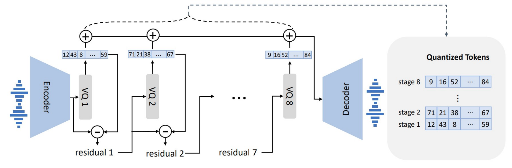{height="480px"}
:::

## VQ & RVQ — Common Issues

- A frame is a vector of codebook indices: $\mathbf{c} = [c_1, c_2, \dots, c_N]$
- But $c_i$ depends on the residual from steps $1, \dots, i{-}1$

::: {.fragment}
$$
c_i = f\bigl(r_{i-1}\bigr) = f\bigl(z_e - \textstyle\sum_{j=1}^{i-1} e_{c_j}\bigr)
$$
:::

- **Codebooks are not independent** — the $i$-th code is meaningless without knowing all previous codes
- Cannot predict the whole frame $\mathbf{c} = [c_1, \dots, c_N]$ at once — ideally need to predict each $c_i$ **autoregressively**, conditioned on $c_1, \dots, c_{i-1}$
- **Dead codes**: some codebook entries are never selected — requires tracking utilization and **reinitialization** strategies
- Training can be **unstable** — balancing reconstruction, commitment, and codebook losses is fragile (applies to both VQ and RVQ)
- Motivates alternatives like **FSQ** that avoid these issues entirely

## FSQ — Finite Scalar Quantization Overview

- **Drop-in replacement** for VQ and RVQ (in theory)
- **No additional losses** — no commitment loss, no codebook loss, no EMA
- **No learned embedding tables** — the codebook is **implicit**, directly quantize the encoder's latent space
- Still uses **STE** to pass gradients through to the encoder
- Achieves very high utilization even for much larger codebooks: $\sim 2^{10}$ in VQ vs $\sim 2^{16}$ in FSQ

## FSQ — A New Quantization Paradigm

- Unlike VQ where $d \geq 512$, FSQ uses a **very small** encoder output: $d < 10$, so $z_e \in \mathbb{R}^d$
- Each dimension is **bounded** to $L_i$ discrete levels via rounding:

::: {.fragment}
$$
\hat{z}_i = \left\lfloor \frac{L_i - 1}{2} \cdot \tanh(z_i) \right\rceil
$$
:::

- Example: $d = 3$, $L = 3$ $\Rightarrow$ each dimension in $\{-1, 0, 1\}$ $\Rightarrow$ **implicit codebook** of size $L^d = 3^3 = 27$
- We can **enumerate all possible vectors** — the codebook is the full Cartesian product: $\mathcal{C} = \{1, 2, \dots, L^d\}$
- In general $L_i$ can differ per dimension — codebook size is $\prod_{i=1}^{d} L_i$

::: {.fragment style="text-align: center;"}
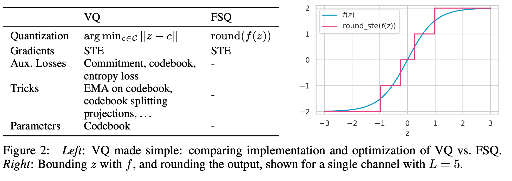{height="450px"}
:::

## VQ vs FSQ — Intuition

- VQ is potentially **more expressive** — it learns where to place each code vector freely in the latent space via separate embedding vectors
- FSQ is **more constrained** — the latent space is bounded, and the encoder must fit its representation into a fixed grid
- This difference is mostly **theoretical** — both models are highly nonlinear, and with powerful enough encoders the expressiveness gap shrinks

::: {.fragment style="text-align: center;"}
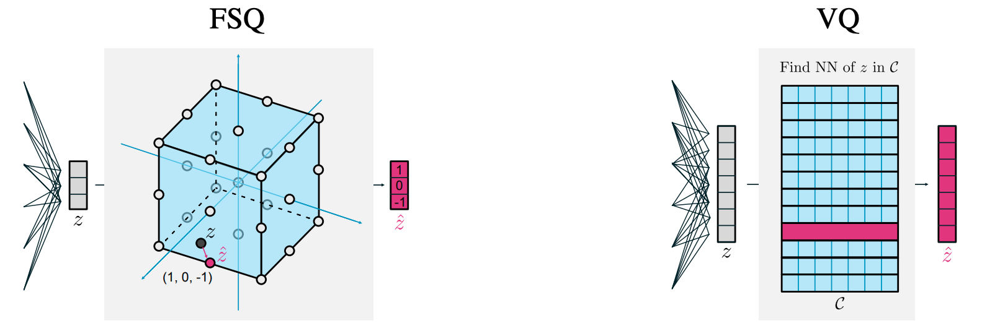{height="500px"}
:::

## FSQ vs VQ — Evaluation

- Train VQ and FSQ on images, then generate images with **MaskGIT** (class-conditional BERT, predicts codes)
- **Reconstruction FID**: Fréchet Inception Distance between real images and their reconstructions
- **Sampling FID**: FID of images generated by MaskGIT using the learned codes
- **Codebook usage**: fraction of codewords used at least once
- **Compression cost**: how hard is it for the model to use this encoding — is codeword usage close to uniform?

::: {.fragment style="text-align: center;"}
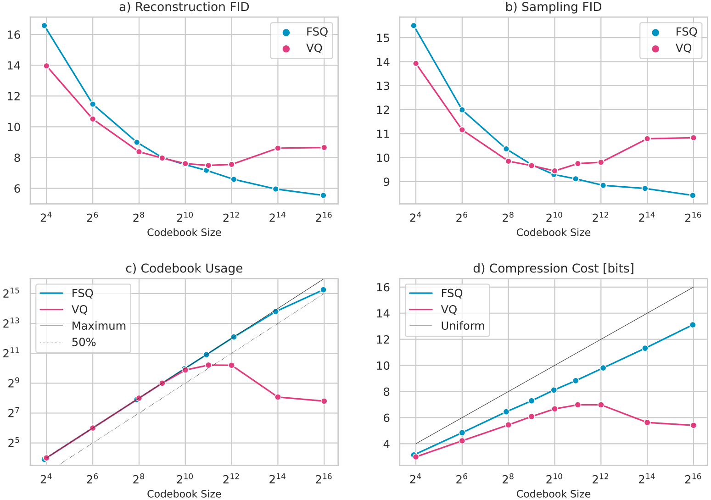{height="700px"}
:::

# LLaSA {background-color="#34495e"}

## LLaSA — Overview

- Many zero-shot voice cloning approaches invent **custom architectures / pipelines** to improve quality
- LLaSA: first attempt to use a **traditional LLM approach** for speech — decoder-only model + audio tokenizer
- Made possible by **FSQ**: no need to change the LLM at all, just **next-token prediction**
- Instead of studying architecture choices, they invest in understanding **scaling principles**: scale compute during training or during inference
- One of the first papers to measure how **scaling inference compute** can significantly improve output quality

## LLaSA — Design

- **Backbones**: LLaMA 3.2 (1B, 3B) and LLaMA 3.1 (8B) with extended vocabulary
- LLM trained on quadruples: *(prompt text, text to generate, audio prompt, audio to generate)* — loss computed **only on audio tokens**
- Target languages: **English and Chinese** (bilingual)
- Dataset sizes: **80k, 160k, 250k hours**
- **XCodec2**: replaces RVQ with FSQ; decoder follows **Vocos** — transformer predicting STFT magnitude & phase + iSTFT to generate audio
- Audio tokenizer trained on **150k hours** (MLS + Emilia), 16 kHz, codebook size **65k**, covering **10 languages** (Asian and European)

## XCodec2 — Results

::: {style="text-align: center;"}
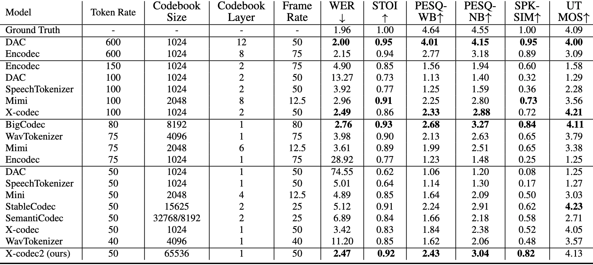{height="600px"}
:::

- **Encodec**: 8 codebooks, 75 Hz frame rate, bitrate $= \log_2(1024) \times 8 \times 75 = 6$ kbps
- **DAC**: 8 codebooks × 50 Hz, bitrate $= \log_2(1024) \times 12 \times 50 = 6$ kbps
- **XCodec2**: single codebook → **0.8 kbps**; BigCodec → 1.04 kbps
- Models with very low kbps achieve **UTMOS scores higher than ground truth** — the decoder acts as a **generator**, not just a reconstructor
- However, **PESQ and speaker similarity (SIM)** are usually lower at low bitrates compared to high-bitrate models

## LLaSA — Training Scaling

Evaluation protocol borrowed from **BASE TTS**:

<table style="width:100%; table-layout:fixed; font-size: 0.65em;">
<colgroup>
<col style="width:12%">
<col style="width:35%">
<col style="width:16%">
<col style="width:21%">
<col style="width:16%">
</colgroup>
<thead>
<tr><th>Category</th><th>Example</th><th>1 (Bad)</th><th>2 (Ok)</th><th>3 (Good)</th></tr>
</thead>
<tbody>
<tr><td>Compound Nouns</td><td>"stone-built quaint countryside holiday cottage"</td><td>Fails to recognise</td><td>Unnatural stress</td><td>Natural phrasal stress</td></tr>
<tr><td>Emotions</td><td>"Oh my gosh! Are we really going to the Maldives?"</td><td>No audible emotion</td><td>Present but insufficient</td><td>Correct recognition</td></tr>
<tr><td>Foreign Words</td><td>"mise en place … pièce de résistance"</td><td>Incorrect pronunciation</td><td>Foreign accent, not quite right</td><td>Correct rendering</td></tr>
<tr><td>Paralinguistics</td><td>"Shh, Lucy, shhh, we mustn't wake…"</td><td>No recognition</td><td>Distinct but unnatural</td><td>Natural rendering</td></tr>
<tr><td>Punctuations</td><td>"Emergency @ home; call ASAP! … #familymatters"</td><td>Glitches on # or &amp;</td><td>No glitch, incorrect</td><td>Correct pausing</td></tr>
<tr><td>Questions</td><td>"will the ministers find the answers in time?"</td><td>Wrong intonation</td><td>Largely correct</td><td>Correct intonation</td></tr>
<tr><td>Syntactic</td><td>"The movie that De Moya … was a box-office hit"</td><td>Fails to parse</td><td>Parses but unnatural</td><td>Correct &amp; natural</td></tr>
</tbody>
</table>

::: {.fragment .nonincremental style="font-size: 1em;"}
- Foreign words, compound nouns → **data**; Punctuation, syntactic complexity → **model size**; Emotions, paralinguistics → **both**
:::

:::: {.columns}
::: {.column width="60%"}
::: {.fragment style="text-align: center;"}
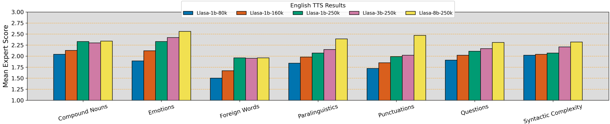{height="300px"}
:::
:::
::: {.column width="40%"}
::: {.fragment style="text-align: center;"}
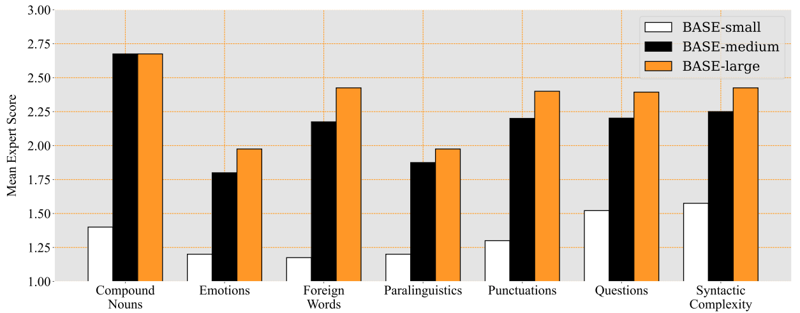{height="320px"}
:::
:::
::::

::: {.fragment .nonincremental style="font-size: 1em;"}
- BASE TTS: trained **from scratch**; **Small** 150M + 1k hrs, **Base** 400M + 10k hrs, **Large** 1B + 100k hrs
:::

## LLaSA — Inference Scaling

::: {.nonincremental style="font-size: 0.85em;"}
Inference compute scaling — three strategies:
:::

- **PRM** (Process Reward Model): beam search during generation — $M$ beams × $N$ candidates, generate ~0.5s chunks, keep top $M$, continue
- **ORM** (Output Reward Model): generate $M \times N$ candidates (to match beam search budget), select best by reward (SIM, WER)
- **Partial PRM**: use PRM for first ~2 seconds, then switch to ORM for the remainder (generate rest, choose best)

::: {.fragment style="text-align: center;"}
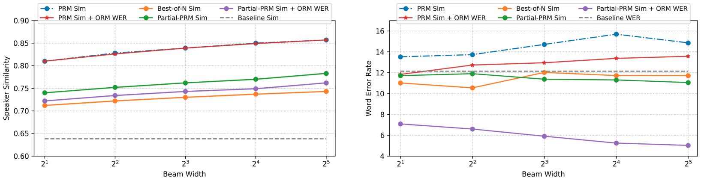{height="520px"}
:::

## LLaSA — Final Results

::: {style="text-align: center;"}
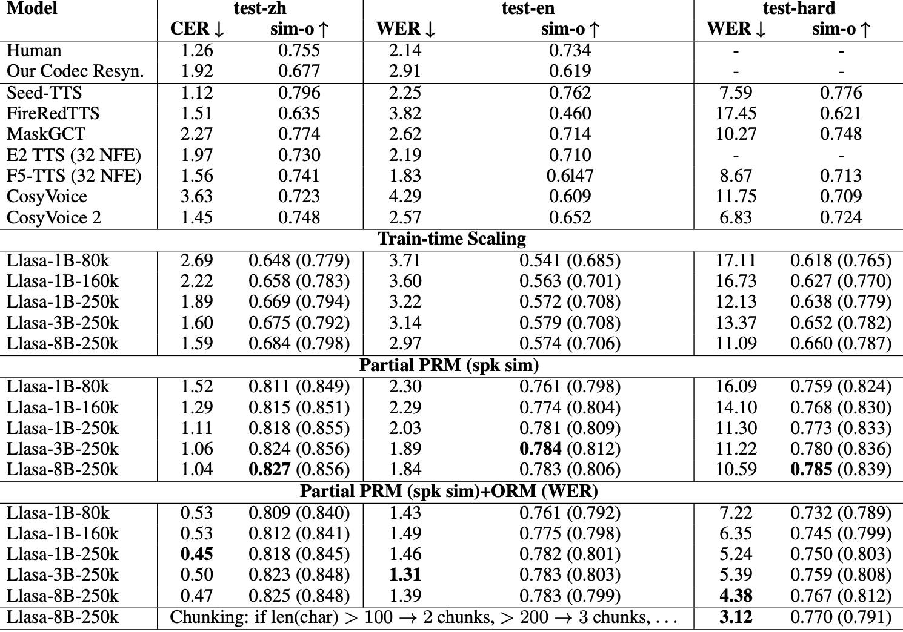{height="800px"}
:::

- Using inference scaling is **not a fair comparison** against baselines (they don't use it)
- But it demonstrates how we can **push quality further** at the cost of extra compute

# Inworld TTS {background-color="#1a5276"}

## Inworld — LLaSA Maxing

- Extends the LLaSA idea (pure LLM machinery) with full training pipeline: **pretraining** (1M hours), **SFT** (200k hours), and **reinforcement learning**
- Two variants: **Small** (LLaMA 3.2 Instruct 1B) and **Large** (LLaMA 3.1 3B)
- XCodec2 at 16 kHz + a **super-resolution component** to generate 48 kHz output
- **Speech Markup Language**: control speaking styles and non-verbals via tags, with **LoRA fine-tuning**
- Streaming audio generation $\neq$ streaming TTS — model needs to see **full text first**, then generates audio in streaming mode
- Architecture is **untouched** — same decoder-only LLM + tokenizer

::: {.fragment style="text-align: center;"}
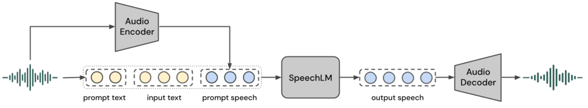{height="380px"}
:::

## Inworld — Audio Tokenizer

- Architecture follows **XCodec2** — input is always **16 kHz** audio
- **50 tokens/s**, codebook size **65k** — same as XCodec2, trained on **110k hours**
- Different decoders for different target sample rates: **16 kHz**, **24 kHz**, and **48 kHz**
- 16 kHz and 24 kHz decoders are **identical** — only difference is iSTFT hop size (320 vs 480); trained independently
- For **48 kHz**: add 1D transposed ResNet blocks for upsampling
  - First train on audios with estimated bandwidth $\geq$ 32 kHz
  - Fine-tune only on audios with estimated bandwidth $\geq$ 44.1 kHz
- All models use an additional **RMS volume loss** — without it, streaming audio generation can produce volume jumps

:::: {.columns}
::: {.column width="70%"}
::: {.fragment style="text-align: center;"}
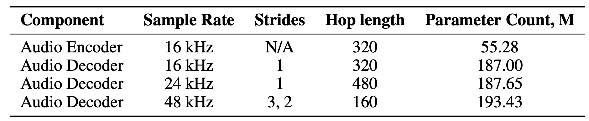{height="250px"}
:::
:::
::: {.column width="30%"}
::: {.fragment style="text-align: center;"}
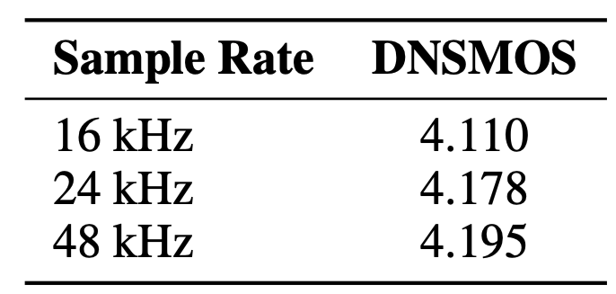{height="250px"}
:::
:::
::::

## Inworld — Pretraining

- Audio without transcripts, fixed duration **40s** segments — start/end marked with special tokens
- Also used **20B text tokens** (instruction data) — without it, model degrades text understanding
- Fixed batch sizes → used **torch.compile** to speed up training
- **32 H100 GPUs**: Small pretrain took **2 days**, Large took **10 days**
- Evaluation: **5k utterances** across languages, **continuation task** — 10s utterances, first half as prompt, measure speaker similarity

:::: {.columns}
::: {.column width="40%"}
::: {.fragment style="text-align: center;"}
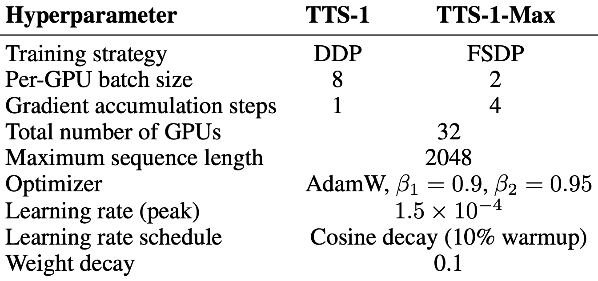{height="350px"}
:::
:::
::: {.column width="60%"}
::: {.fragment style="text-align: center;"}
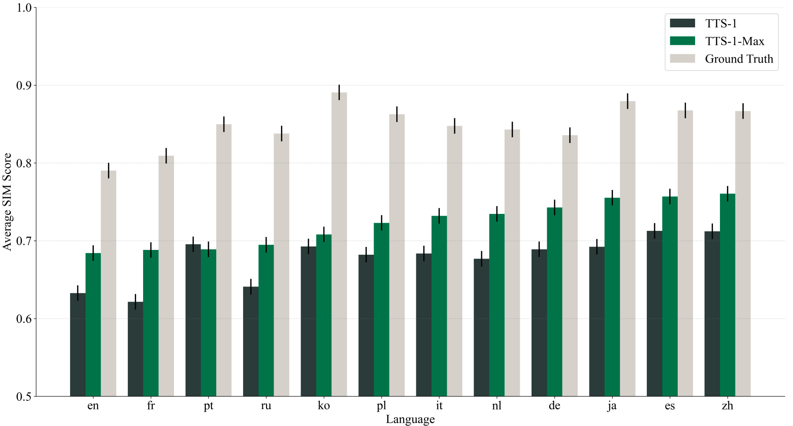{height="350px"}
:::
:::
::::

## Inworld — SFT

- **Data preparation** — DNSMOS + language-specific CPS (chars/sec) filtering:
  - Filter out bottom **20%** by DNSMOS
  - Remove **5% outliers** (each end) for CPS per language
  - Filter out pairs with low-quality transcriptions (excess punctuation, non-speech content)
- Train NTP on audio tokens: `<|begin_of_text|>` $x_1, \dots, x_T$ `<|speech_start|>` $y_1, \dots, y_S$ `<|speech_end|>`
- Variable-length sequences → **torch.compile unavailable** — ~3× slowdown vs pretraining
- Experimented with SFT on **pretrained** and **non-pretrained** (text-base initialization) models
- Tried **instruction following** during SFT but it failed — appears unsupported (dead code remains)

:::: {.columns}
::: {.column width="50%"}
::: {.fragment style="text-align: center;"}
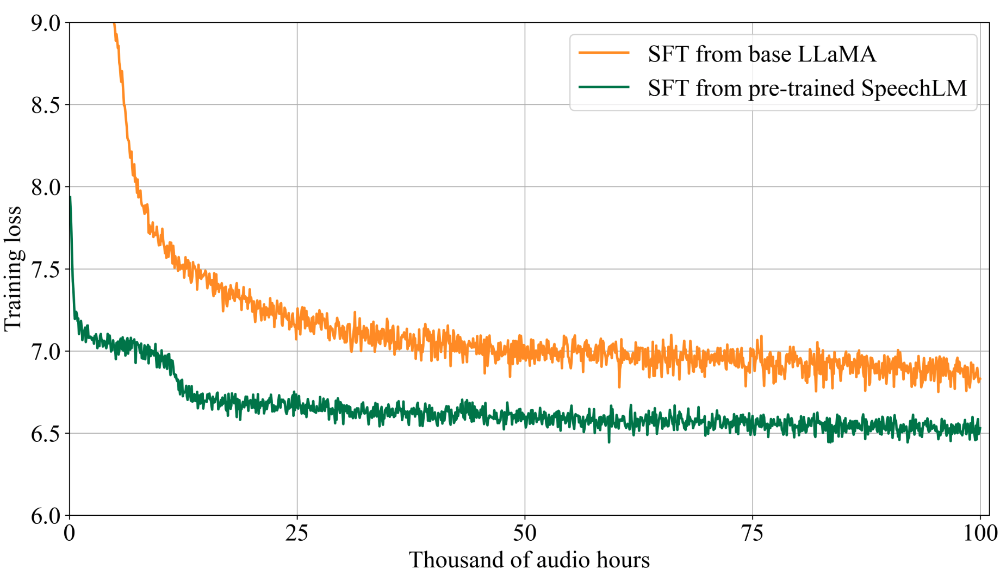{height="500px"}
:::
:::
::: {.column width="50%"}
::: {.fragment style="text-align: center;"}
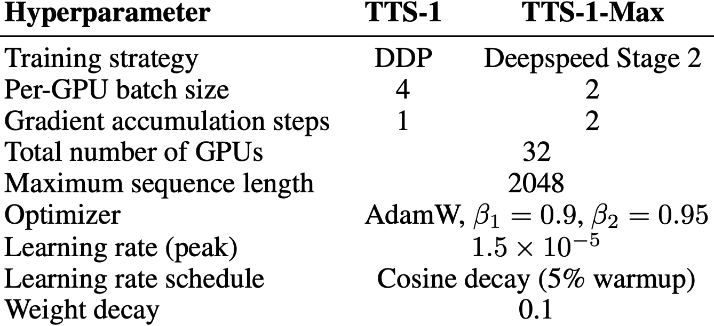{height="450px"}
:::
:::
::::

## Inworld — Reinforcement Learning

- **GRPO**: sample several audio completions for the same prompt, reinforce outputs scoring **above group average**, suppress those below
- Rewards computed on decoded 48 kHz waveform: **Whisper WER**, **WavLM speaker similarity**, **DNSMOS quality**
- Train both **single-reward** variants and a **unified model** (three normalized rewards summed with equal weights)
- **Clipped updates + KL penalty** keep RL model close to SFT checkpoint — reduces reward-driven degeneration
- Compare three **specialized models** (one reward each) vs one **unified model** (all three rewards)

::: {.fragment style="text-align: center;"}
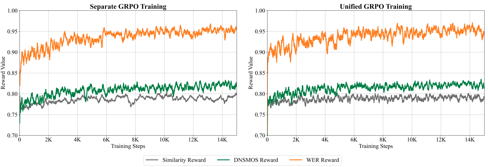{height="550px"}
:::

## Inworld — Audio Markups

- Tags control style and non-verbals: `[angry]`, `[whispering]`, `[laugh]`, `[sigh]`
- Adding style tags during normal SFT **failed** — model often ignored them
- Codec tokens mix speaker identity, style, prosody, and content
- Train on same-speaker **neutral + styled recordings** joined by silence
- Separate **LoRA stage** learns markup control on ~180 hours of English data, likely after RL
- Tag embeddings may remain poorly learned — LoRA updates model layers, not the embedding table
- Style control **transfers to other languages** despite English-only markup training
- Combining tags creates **meaningful new styles** not seen during training
- Speaker embeddings may help separate speaker and style, but style can still leak into them
- Paper and code **do not fully match**; some users report tags being spoken aloud; no evidence in code that style tags are actual tags
- In general, **evaluation of style control is very difficult** — no standard metrics or benchmarks

:::: {.columns}
::: {.column width="50%"}
::: {.fragment style="text-align: center;"}
<!-- {height="300px"} -->
:::
:::
::: {.column width="50%"}
::: {.fragment style="text-align: center;"}
<!-- {height="300px"} -->
:::
:::
::::

## Inworld — Evaluation

:::: {.columns}
::: {.column width="30%"}
::: {style="text-align: center;"}
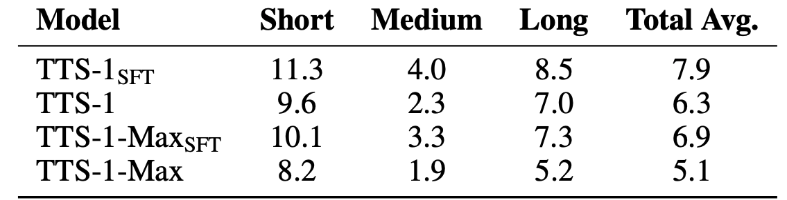{height="150px"}
:::
:::
::: {.column width="70%"}
::: {style="text-align: center;"}
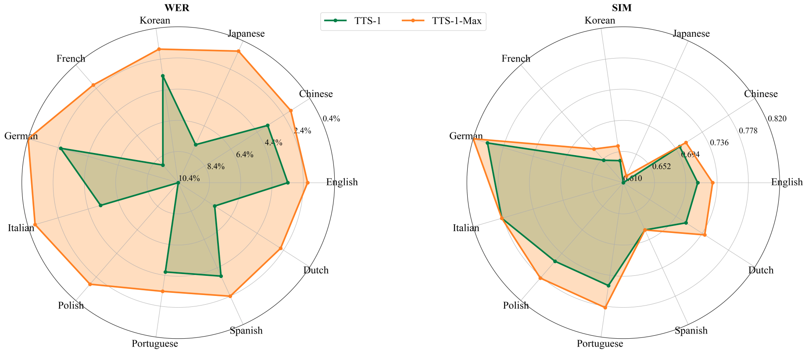{height="400px"}
:::
:::
::::

- **WER** (English only) across different text lengths — compared full pipeline (pretrain + SFT + RL) vs SFT only
- Generated **100 sentences** for each of **11 supported languages**, synthesized with same set of speakers (Small and Large)
- **Internal arena**: 20 human voters, 400 evaluations total

::: {.fragment style="text-align: center;"}
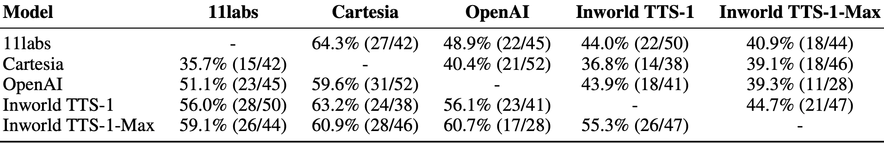{height="250px"}
:::

## References

::: {.nonincremental}
- Mentzer et al., "Finite Scalar Quantization: VQ-VAE Made Simple" (ICLR 2024)
- LLaSA paper and XCodec2
- Inworld AI documentation
:::

## {background-color="#2c3e50"}

::: {style="text-align: center; margin-top: 200px;"}
### Thank you!

Questions?
:::
