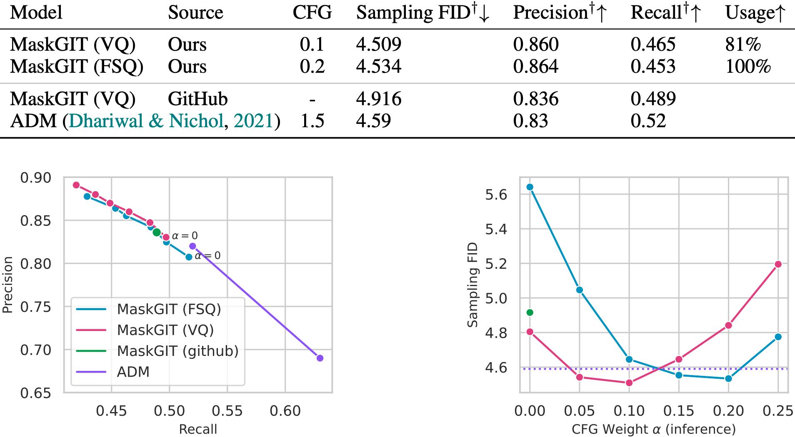

# Finite Scalar Quantization {background-color="#2d4059"}

## VQ Recap — Quantized VAE

- VAE with a **quantization bottleneck**: encoder $\rightarrow$ continuous latent $z_e$ $\rightarrow$ quantize $\rightarrow$ decoder
- Quantization: map $z_e$ to the **nearest codebook entry** (argmin / nearest-neighbor)

::: {.fragment}
$$
z_q = e_k, \quad k = \arg\min_j \| z_e - e_j \|_2
$$
:::

- Codebook $\mathcal{C} = \{e_k\}_{k=1}^{K}$ is a **learnable embedding table**
- Argmin is not differentiable — use **STE**: copy gradients from decoder input straight to encoder output
- VAE formulation holds exactly, but KL term is **constant** — we use a deterministic policy (argmin), not sampling
- Training uses **reconstruction**, **codebook**, and **commitment** losses (sometimes EMA instead of codebook loss) — needed to make VQ-VAE learn and stabilize training

## RVQ — Residual Vector Quantization

- What if **one codebook is not enough**?
- Naive fix: just make the codebook larger — but this **doesn't scale**; utilization drops sharply beyond $\sim 2^{11}$ entries (codebook collapse)
- Better idea: quantize, compute the **residual**, quantize the residual, repeat

::: {.fragment}
$$
r_0 = z_e, \quad z_q^{(i)} = \text{VQ}_i(r_{i-1}), \quad r_i = r_{i-1} - z_q^{(i)}
$$
:::

- Final representation: $\hat{z} = \sum_{i=1}^{N} z_q^{(i)}$ — sum of $N$ codebook lookups
- Much more **versatile** than single-codebook VQ

::: {.fragment style="text-align: center;"}
{height="400px"}
:::

## VQ & RVQ — Common Issues

- A frame is a vector of codebook indices: $\mathbf{c} = [c_1, c_2, \dots, c_N]$
- But $c_i$ depends on the residual from steps $1, \dots, i{-}1$

::: {.fragment}
$$
c_i = f\bigl(r_{i-1}\bigr) = f\bigl(z_e - \textstyle\sum_{j=1}^{i-1} e_{c_j}\bigr)
$$
:::

- **Codebooks are not independent** — the $i$-th code is meaningless without knowing all previous codes
- Cannot predict the whole frame $\mathbf{c} = [c_1, \dots, c_N]$ at once — ideally need to predict each $c_i$ **autoregressively**, conditioned on $c_1, \dots, c_{i-1}$
- **Dead codes**: some codebook entries are never selected — requires tracking utilization and **reinitialization** strategies
- Training can be **unstable** — balancing reconstruction, commitment, and codebook losses is fragile (applies to both VQ and RVQ)
- Motivates alternatives like **FSQ** that avoid these issues entirely

## FSQ — Finite Scalar Quantization Overview

- **Drop-in replacement** for VQ and RVQ (in theory)
- **No additional losses** — no commitment loss, no codebook loss, no EMA
- **No learned embedding tables** — the codebook is **implicit**, directly quantize the encoder's latent space
- Still uses **STE** to pass gradients through to the encoder
- Achieves very high utilization even for much larger codebooks: $\sim 2^{10}$ in VQ vs $\sim 2^{16}$ in FSQ

## FSQ — A New Quantization Paradigm

- Unlike VQ where $d \geq 512$, FSQ uses a **very small** encoder output: $d < 10$, so $z \in \mathbb{R}^d$
- Each dimension is **bounded** to $L_i$ discrete levels via rounding:

::: {.fragment}
$$
\hat{z}_i = \left\lfloor \frac{L_i - 1}{2} \cdot \tanh(z_i) \right\rceil
$$
:::

- Example: $d = 3$, $L = 3$ $\Rightarrow$ each dimension in $\{-1, 0, 1\}$ $\Rightarrow$ **implicit codebook** of size $L^d = 3^3 = 27$
- We can **enumerate all possible vectors** — the codebook is the full Cartesian product: $\mathcal{C} = \{1, 2, \dots, L^d\}$
- In general $L_i$ can differ per dimension — codebook size is $\prod_{i=1}^{d} L_i$

::: {.fragment style="text-align: center;"}
{height="350px"}
:::

## VQ vs FSQ — Intuition

- VQ is potentially **more expressive** — it learns where to place each code vector freely in the latent space via separate embedding vectors
- FSQ is **more constrained** — the latent space is bounded, and the encoder must fit its representation into a fixed grid
- This difference is mostly **theoretical** — both models are highly nonlinear, and with powerful enough encoders the expressiveness gap shrinks

::: {.fragment style="text-align: center;"}
{height="450px"}
:::

## FSQ vs VQ — Evaluation

- Train VQ and FSQ on images, then generate images with **MaskGIT** (class-conditional BERT, predicts codes)
- **Reconstruction FID**: Fréchet Inception Distance between real images and their reconstructions
- **Sampling FID**: FID of images generated by MaskGIT using the learned codes
- **Codebook usage**: fraction of codewords used at least once
- **Compression cost**: how hard is it for the model to use this encoding — is codeword usage close to uniform?

::: {.fragment style="text-align: center;"}
{height="700px"}
:::

## MaskGIT Results — FSQ vs VQ vs ADM

- FSQ config: $L = [8, 5, 5, 5]$ $\Rightarrow$ codebook size $= 8 \times 5^3 = 1000$
- **Classifier-Free Guidance (CFG)**: MaskGIT trained with 10% of labels replaced by MASK; at inference, combine class-conditional and unconditional logits:

::: {.fragment}
$$
\ell' = \ell_c + \alpha(\ell_c - \ell_\emptyset)
$$
:::

- **Precision & Recall**: via a learned classifier — how well do generated images match real distributions
- Baseline: **ADM** (diffusion model) — FSQ + MaskGIT is competitive with diffusion-based generation

::: {.fragment style="text-align: center;"}
{height="550px"}
:::

# LLaSA {background-color="#34495e"}

## LLaSA — Overview

- **L**arge **La**nguage model based **S**peech synthesis with spontaneous **A**ttributes
- Leverages pre-trained LLMs for text-to-speech
- Models spontaneous speech phenomena (fillers, pauses, laughter)
- Codec-based: audio $\rightarrow$ discrete tokens $\rightarrow$ LLM $\rightarrow$ audio

## LLaSA — Architecture

:::: {.columns}
::: {.column width="55%"}

- **Speech tokenizer**: XCodec2 — audio to discrete tokens
- **Language model**: fine-tuned LLaMA
- **Vocoder**: reconstructs waveform from tokens

:::
::: {.column width="45%"}

<!-- Replace with your own architecture diagram -->
<!--  -->

:::
::::

## LLaSA — Token Representation

- XCodec2 produces a single-codebook token stream
- Each token represents ~20ms of audio
- Text and speech tokens share the same vocabulary

$$
\mathcal{V} = \mathcal{V}_{\text{text}} \cup \mathcal{V}_{\text{speech}}
$$

- The LLM is trained autoregressively on interleaved text + speech

## LLaSA — Animated Derivation Example

::: {.nonincremental}
Autoregressive generation objective:
:::

::: {.fragment}
$$
p(\mathbf{s} \mid \mathbf{t}) = \prod_{i=1}^{N} p(s_i \mid s_{<i}, \mathbf{t})
$$
:::

::: {.fragment}
$$
\mathcal{L}_{\text{AR}} = -\sum_{i=1}^{N} \log p(s_i \mid s_{<i}, \mathbf{t})
$$
:::

::: {.fragment}
$$
= -\mathbb{E}_{(\mathbf{t}, \mathbf{s}) \sim \mathcal{D}} \left[ \sum_{i=1}^{N} \log p_\theta(s_i \mid s_{<i}, \mathbf{t}) \right]
$$
:::

# Inworld TTS {background-color="#1a5276"}

## Inworld — Context

- Real-time TTS for interactive AI characters
- Low latency requirement for conversational AI
- Must handle diverse speaking styles and emotions
- Integration with game engines and virtual worlds

## Inworld — Key Requirements

- **Streaming**: first audio chunk before full generation
- **Expressiveness**: emotion, emphasis, pacing
- **Consistency**: stable character voice across sessions
- **Efficiency**: run on consumer hardware

## Inworld — Code Example

```{.python code-line-numbers="|3-5|7-9"}
from inworld import InworldClient

client = InworldClient(
    api_key="your-api-key",
    scene="scenes/my-scene"
)

response = client.send_text("Hello, adventurer!")
audio = response.audio  # streaming audio chunks
```

# Summary {background-color="#2c3e50"}

## Comparison

| | FSQ | LLaSA | Inworld |
|---|---|---|---|
| Type | Quantizer | TTS model | TTS platform |
| Key idea | Deterministic rounding | LLM-based codec TTS | Real-time character TTS |
| Codebook | Implicit | XCodec2 | Proprietary |
| Open source | ✓ | ✓ | Partial |

## Key Takeaways

- **FSQ** simplifies quantization — no codebook, no collapse, drop-in VQ replacement
- **LLaSA** shows LLMs can generate natural, spontaneous speech
- **Inworld** brings expressive TTS to real-time interactive applications
- Common thread: **discrete audio tokens** enable language-model approaches to speech

## References

::: {.nonincremental}
- Mentzer et al., "Finite Scalar Quantization: VQ-VAE Made Simple" (ICLR 2024)
- LLaSA paper and XCodec2
- Inworld AI documentation
:::

## {background-color="#2c3e50"}

::: {style="text-align: center; margin-top: 200px;"}
### Thank you!

Questions?
:::
