# Magpie TTS {background-color="#2d4059"}

## Magpie TTS — Overview

- NVIDIA's state-of-the-art multilingual TTS system, built on the [NeMo Speech](https://github.com/NVIDIA-NeMo/Speech) framework
- **Neural audio codec** — [NanoCodec](https://huggingface.co/nvidia/nemo-nano-codec-22khz-1.89kbps-21.5fps) — decodes those tokens into high-fidelity audio
- **5 English speakers and 12 languages:** Arabic, Chinese, English, French, German, Hindi, Italian, Japanese, Korean, Portuguese, Spanish, Vietnamese
- Predicts discrete codec tokens autoregressively with a **transformer encoder–decoder**
- Innovations and tricks:
  - **Frame stacking** (factor 2) — two codec frames per decoder step
  - **Local transformer** — fine-grained refinement within a stacked frame
  - **Auxiliary CTC loss** on the cross-attention matrix to enforce monotonic alignment
  - **Attention priors** — a diagonal prior biases text↔audio cross-attention early in training
  - **Classifier-free guidance (CFG)** — drop conditioning during training, modify logits at inference — significantly improves speaker similarity and intelligibility
  - **Group Relative Policy Optimization (GRPO)** — RL post-training
- Weights and demo: [nvidia/magpie_tts_multilingual_357m](https://huggingface.co/nvidia/magpie_tts_multilingual_357m)

# Recap {background-color="#2d4059"}

## Multi-Receptive Field Fusion (HiFi-GAN Decoder)

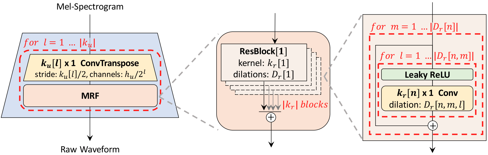{fig-align="center" width="60%"}

- **Multi-Receptive Field Fusion**: models patterns of various lengths — one dedicated residual block per "length", returning the **sum** of all residual blocks
- Upsample sizes $k_u = (16, 16, 4, 4)$ — each $k_u[i]$ upsampling layer is followed by its own MRF, and every such MRF contains the same $|k_r|$ residual blocks
- **Residual block $i$** is specified by kernel size $k_r[i]$ and dilation rates $D_r[i]$
- Residual kernels $k_r = (3, 7, 11)$ and dilation rates $D_r = ((1,1), (3,1), (5,1)) \times 3$ — note that $|k_r| = |D_r|$
- E.g. $n = 1$ → $k_r[n] = 7$ and $D_r[n] = ((1,1), (3,1), (5,1))$; for each dilation tuple we perform **2 convolutions in a row**

## MRF — Continued

:::: {.columns}
::: {.column width="50%"}
{.nostretch}
:::
::: {.column width="50%"}
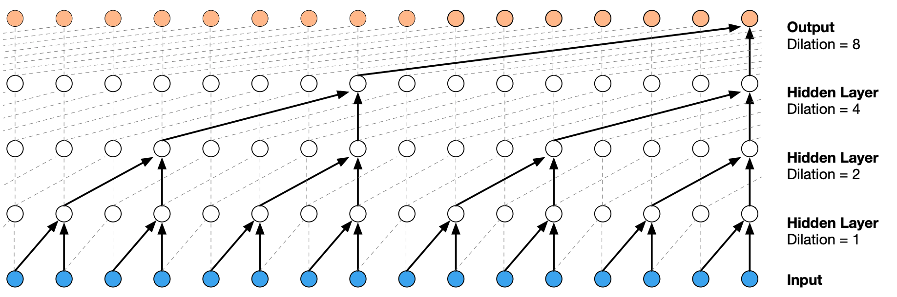{.nostretch}
:::
::::

```python
for i in range(self.num_upsamples):               # 4 stages, k_u = (16, 16, 4, 4)
    x = self.transposed_convs[i](leaky_relu(x))   # T *= k_u[i] // 2
    xs = 0                                        # ---------- MRF ----------
    for n in range(self.num_kernels):             # k_r = (3, 7, 11) parallel branches
        res = x                                   # residual block, kernel size k_r[n]
        for c1, c2 in zip(self.convs1[i][n], self.convs2[i][n]):   # D_r = ((1,1), (3,1), (5,1)) × 3
            h = c1(leaky_relu(res))               # dilation 1, 3, 5
            h = c2(leaky_relu(h))                 # dilation 1
            res = res + h                         # 2 convs in a row, then skip
        xs = xs + res
    x = xs / self.num_kernels                     # same shape as x
```
- As the kernel grows, so does the receptive field of the $i$-th residual block
- Only `transposed_convs[i]` changes the shape
- All $|k_r|$ branches receive the same `x` and are shape-preserving

## Waveform Discriminators

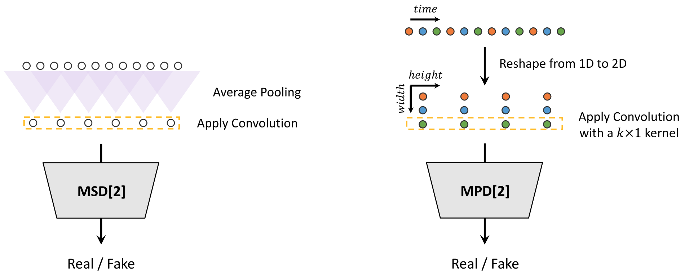{.nostretch fig-align="center" width="55%"}

- **Multi-Scale Discriminator** — different receptive fields: raw audio, ×2 and ×4 avg-pooled (HiFi-GAN, MelGAN)
- **Multi-Period Discriminator** — different periods, usually primes $[2, 3, 5, 7, 11]$, so it can analyze different periodic patterns in the audio (HiFi-GAN)
- Usually all discriminators are paired with a **feature matching loss**:

  $$\mathcal{L}_{FM}(G) = \mathbb{E}_{(x, s)} \left[ \frac{1}{K} \sum_{k=1}^{K} \frac{1}{T_k} \sum_{i=1}^{T_k} \frac{1}{N_{k,i}} \left\lVert D_k^i(x) - D_k^i(G(s)) \right\rVert_1 \right]$$

  where $D_k^i$ are the layer-$i$ features of discriminator $k$ and $N_{k,i}$ their element count

## Spectral Discriminator

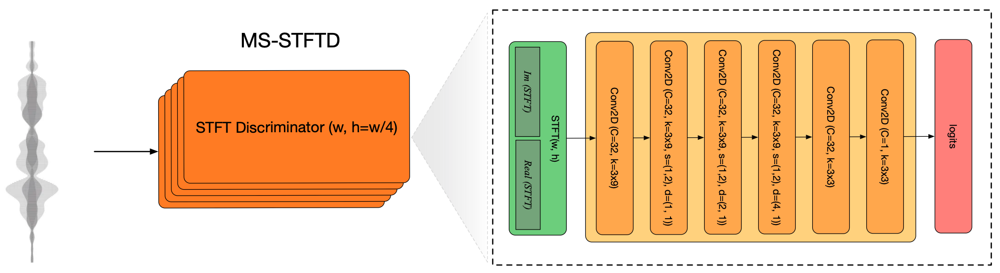{.nostretch fig-align="center" width="55%"}

- **Multi-Scale STFT Discriminator** — processes audio with STFTs of different window lengths $[2048, 1024, 512, 256, 128]$, hop size derived from the window size (EnCodec)
- **Phases are also used** (complex part) — bad phase makes the sound less crispy; complex values are just **concatenated**, not a second channel
- Other variations:
  - **Multi-Resolution Discriminator (MRD)** — same STFT resolutions, magnitude only (UnivNet, BigVGAN, Vocos)
  - **Multi-Scale Mel Discriminator** — better for human perception, ignores phase (DAC)
  - **Multiple bands** — adds another dimension, frequency bands, so each discriminator only looks at specific frequencies (DAC, WavTokenizer)

# Spectral Codec {background-color="#2d4059"}

## Spectral Codec — Outline

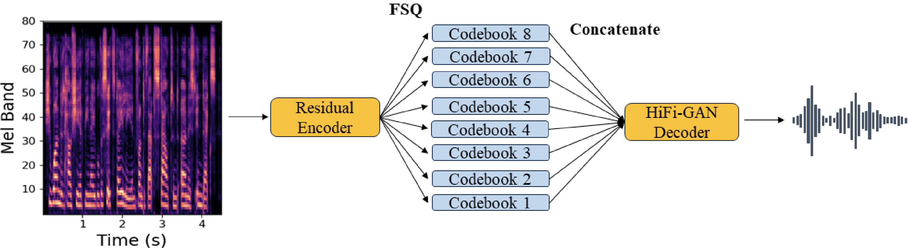{fig-align="center" width="70%"}

- Operates on **mel spectrograms** rather than raw waveforms; compares RVQ vs FSQ quantization
- Evaluates downstream TTS quality with AR and NAR FastPitch variants
- Adopts **group quantization** (HiFi-Codec): partition the latent into groups, quantize each independently
- **44.1 kHz HiFi-GAN** vocoder as the waveform decoder
- **86.1 tokens/s** across 8 parallel codebooks (size 1k each) → 6.9 kbps
- Training losses: multi-resolution mel spectrogram + multi-resolution log-magnitude STFT
- Adversarial training: MPD + multi-scale complex STFT discriminator


## Spectral Codec — Details

<div style="display: flex; gap: 1.5em; margin-bottom: 1em;">
<div class="fragment" style="flex: 6; background: #f0f4f8; border-radius: 12px; padding: 0.8em 1.2em;">

<span style="font-size: 1.3em; font-weight: 700;">Spectral Variant</span>

::: {.nonincremental}
- **Asymmetric**: mel spectrogram input → latent dim 32 (FSQ) or 128 (RVQ)
- **FSQ**: 8 parallel codebooks, each quantizing 4 dims into $[8, 5, 5, 5]$ levels - 1k values per codebook
- **RVQ**: 8 codebooks of size 1024
:::

</div>
<div class="fragment" style="flex: 4; background: #f0f4f8; border-radius: 12px; padding: 0.8em 1.2em;">

<span style="font-size: 1.3em; font-weight: 700;">Waveform Variant</span>

::: {.nonincremental}
- **Symmetric**: encoder mirrors the HiFi-GAN decoder
- FSQ and RVQ setups identical to the spectral variant
:::

</div>
</div>

<div class="fragment" style="background: #f0f4f8; border-radius: 12px; padding: 0.8em 1.2em;">

<span style="font-size: 1.3em; font-weight: 700;">Downstream TTS</span>

::: {.nonincremental}
- **FastPitch (NAR)**: predicts mel spectrogram from text, pitch, and energy inputs
- 8 parallel heads with softmax classification instead of L2 regression
- **AR variant**: adds causal attention and additional feed-forward layers
:::

</div>


## Spectral Codec — Results

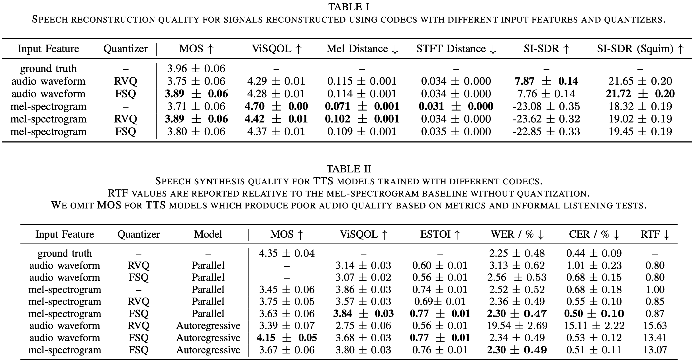{fig-align="center" width="70%"}

- **Upper bound**: HiFi-GAN without quantization (oracle reconstruction)
- Spectral codecs excel on mel spectrogram-based metrics; waveform codecs on waveform-based
- ⚠️ RVQ vs FSQ downstream comparison is unfair: RVQ uses parallel prediction heads
- **NAR** performance on the **spectral** variants is significantly better than on the **waveform** ones
- Discrete pipeline (FastPitch → codec decoder) **outperforms** the classic continuous baseline (oversmoothing)


# RVQ Patterns (MusicGen) {background-color="#2d4059"}

## Visualization

::: {.wrapfig style="width: 55%;"}
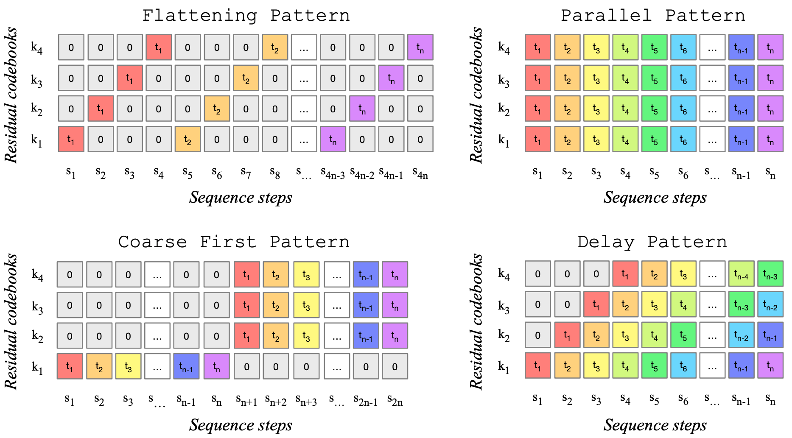{.nostretch}
:::

- GPT with multiple heads, **4 codebooks**, sequence length $n$
- The pattern decides how the $4 \times n$ token grid is unrolled into decoding steps
- **Flattening** — all codebooks serialized → $4n$ steps, slowest but fully autoregressive
- **Parallel** — emit a whole timestep at once → $n$ steps, but codebooks are assumed **independent**
- **Coarse First** — a **single model**: codebook 1 is generated for the whole sequence first, then the remaining codebooks in parallel → $2n$ steps
  - **Coarse First** $\neq$ **VALL-E**, which realizes the same coarse-to-fine idea with **two models** — AR for codebook 1 + NAR for the rest, in $n + (4 - 1)$ steps
- **Delay** — keeps RVQ's dependency (codebook $i$ conditioned on $i-1$) by **offsetting codebook $i$ by $i-1$ steps**
  - each step is predicted sequentially in the codebook dimension *and* in time, producing the diagonal stripes
  - a single model, $n + (4 - 1)$ steps

## Other Patterns

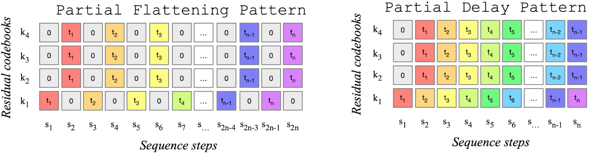{.nostretch fig-align="center" width="65%"}

- **Partial Flattening** — a reorganized Coarse First pattern: after the first codebook, all remaining codebooks are predicted in the **next single step**
- **Partial Delay** — Delay + Parallel patterns: after the first codebook, the rest are predicted **in parallel** (Moshi)

<div class="fragment" style="background: #f0f4f8; border-radius: 12px; padding: 0.8em 1.2em;">

Except for the Parallel pattern, the model input at time $t$ is **not** the audio representation at $t-1$ — it is simply the **sum of the previous predictions** at $t-1$, according to the pattern. For the Delay pattern:

$$X_{t+1} = \text{emb}_1\big(q_{t,\,1}\big) + \text{emb}_2\big(q_{t-1,\,2}\big) + \dots + \text{emb}_K\big(q_{t-K+1,\,K}\big)$$

Whether head $k$ is **active** at time $t$ also depends on the pattern — inactive heads contribute a special token instead of a prediction.

</div>

## Pattern Comparison

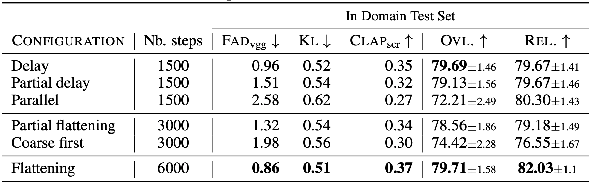{.nostretch fig-align="center" width="60%"}

- Text-conditioned **music generation**, audio tokenized with **EnCodec**
- **Objective metrics:**
  - **FAD** ↓ — Fréchet Audio Distance between real and generated audio embeddings
  - **KL** ↓ — divergence between the label distributions an **AudioSet** classifier assigns to the real and the generated audio
  - **CLAP** ↑ — agreement score from a CLIP-like audio–text model between the description and the generated music
- **Subjective metrics** — human-rated on a $0$–$100$ scale:
  - **OVL** ↑ — overall perceptual quality
  - **REL** ↑ — relevance of the generated audio to the description

# Monotonic Alignment with CTC Loss {background-color="#2d4059"}

## Overview

- By default, text↔audio alignment is learned **implicitly** by the **attention (cross-attention)** module
- This allows training **without any alignment information**, but the learned alignment is **unconstrained** and may not be strictly **monotonic**
- Non-monotonicity causes various errors — **word skipping**, **repetition**, even **infinite silence** — making models unreliable for production
- The issue becomes more visible on **complex inputs** (e.g. repeated words)
- **Defaults:** pretrained encoder–decoder T5-TTS model with the **Spectral Codec**, 1.8k hours of English
- Trained on **triples** — (text to generate, audio prompt, audio to generate); unlike other approaches, the **transcript of the audio prompt is not used**
- **Paper contributions:**
  - **Alignment techniques** that guide cross-attention towards monotonic alignment
  - A comparison between **FSQ** with **parallel generation** and **RVQ** with a **delay pattern**

## Alignment Learning

::: {.wrapfig}
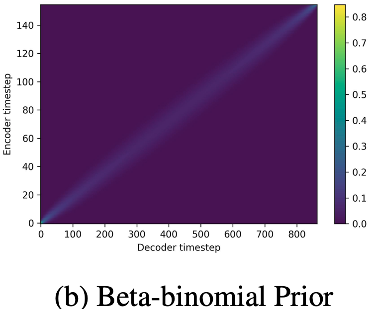{.nostretch width="80%"}
:::

- During early training, cross-attention is multiplied by a **static 2D beta-binomial prior**
- The prior is a matrix with **cigar-shaped diagonal** values, given by the beta-binomial PMF:

  $$f_B(k;\, n, \alpha, \beta) = \binom{n}{k} \frac{B(k + \alpha,\; n - k + \beta)}{B(\alpha, \beta)}$$

- It is evaluated as $P_{k,t} = f_B\big(k;\, N,\; \omega t,\; \omega (T - t + 1)\big)$, where $\omega$ is a **width factor**, $k$ the **text token index**, $t$ the **audio token index**, $N$ the **text length** and $T$ the **audio length**
- **Schedule:** for the first $S_1$ steps simply multiply cross-attention by the prior, then over the next $S_2$ steps **anneal** it towards a matrix of all ones

- **Observation:** the CTC loss formulation allows all possible **monotonic alignments** to be considered
- Given that the audio token sequence is longer than the text token sequence, the CTC loss can be computed on **all cross-attention matrices** → penalizing the model for **non-monotonic** attention

  $$\mathcal{L}_{\text{align}} = \text{CTCLoss}\big(\log A,\; y\big), \qquad A \in \mathbb{R}^{T \times N}$$

  where $A$ is the cross-attention matrix (audio steps $\times$ text tokens) treated as per-step emission probabilities, and $y$ is the text transcript

## Cross-Attention Visualized

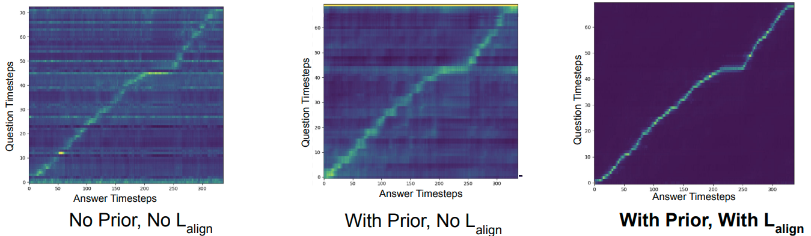{fig-align="center"}

- **Question timesteps** are the **text** to generate, **answer timesteps** are the **audio token sequence**
- The **prior alone** visually sharpens the alignment, but it is **not enough** — only adding the **CTC loss** makes it strictly monotonic

## Ablations

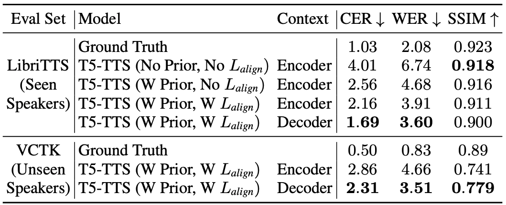{.nostretch fig-align="center" width="40%"}

- The authors experimented with **where to place the audio prompt**: encoder or decoder
- There is no version with $\mathcal{L}_{\text{align}}$ (CTC loss) but **without the prior** — results were **unintelligible**, even though the attention was monotonic

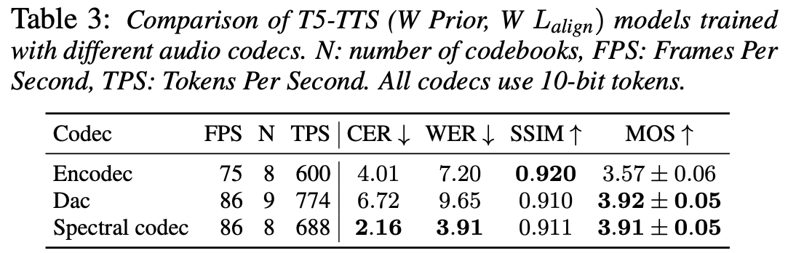{.fragment .nostretch fig-align="center" width="40%"}

- As we will see later, even though **DAC** has the best reconstruction, it does **not** perform well downstream

## Evaluation

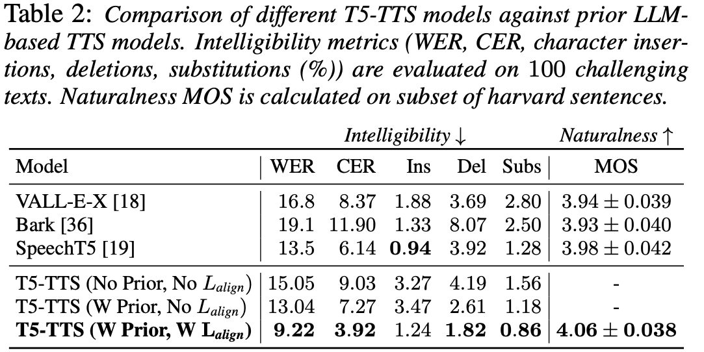{.nostretch fig-align="center" width="50%"}

- ⚠️ For the baselines the authors took **pretrained models with official checkpoints**
- **WER evaluation** — 100 **challenging texts** and 2 **seen speakers** (male and female)
- **MOS evaluation** — 100 sentences from the **Harvard Sentences**, each audio rated by at least **10 listeners** → **2k** evaluations per model

# Low Frame Rate Codec {background-color="#2d4059"}

## Low Frame Rate Codec — Outline

- **Reused from the Spectral Codec:**
  - **FSQ** quantization with **8 parallel codebooks**
  - **HiFi-GAN** waveform decoder
  - Retains the same adversarial **discriminators** (MPD + multi-scale complex STFT)
- **Key modifications:**
  - Frame rate cut to **21.5 fps** (vs. **86.1 fps** in the Spectral Codec) → far fewer tokens per second
  - **Two-stage training**: first trained **without quantization**, then fine-tuned **with quantization**
  - Larger **FSQ** codebooks: **2016** levels ($[8, 7, 6, 6]$) per codebook vs. **1000** ($[8, 5, 5, 5]$) in the Spectral Codec
  - Consumes **raw audio** directly instead of **mel spectrograms**
  - Adds a **convolutional WavLM-based discriminator**
  - Operates at **22.05 kHz**

<div class="fragment" style="background: #f0f4f8; border-radius: 12px; padding: 0.8em 1.2em;">

**LFSC Encoder:** HiFi-GAN **MRF** blocks with **dilation rate 1**, each followed by a strided **1D conv** for downsampling → strides mirror the decoder's upsampling

</div>

## Low Frame Rate Codec — Reconstruction

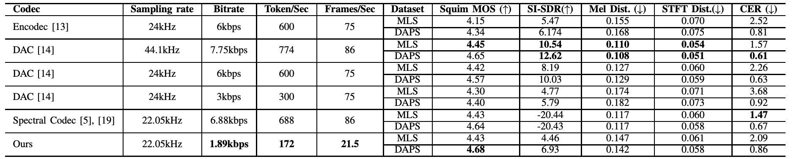{.nostretch fig-align="center" width="85%"}

- For reference-based metrics, the **reference is resampled** to each codec's own sample rate
- **DAC** is strong, but only at its **full bitrate**
- The Spectral Codec has very poor **SI-SDR** yet good **Mel distance** — consistent with the earlier observation that spectral and waveform codecs each excel in their own domain

## Low Frame Rate Codec — Ablations

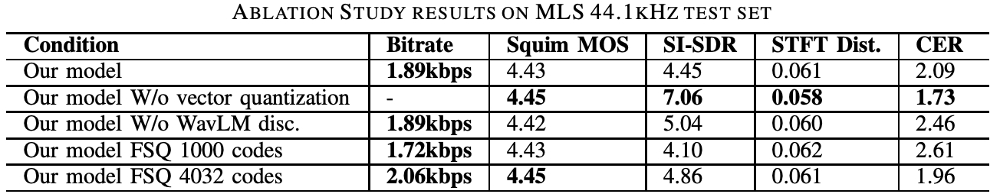{.nostretch fig-align="center" width="70%"}

- Scaling FSQ from **1000** to **2016** levels helps, but scaling further gives **diminishing returns**
- The **WavLM discriminator** improves **intelligibility**

## Low Frame Rate Codec — TTS Results

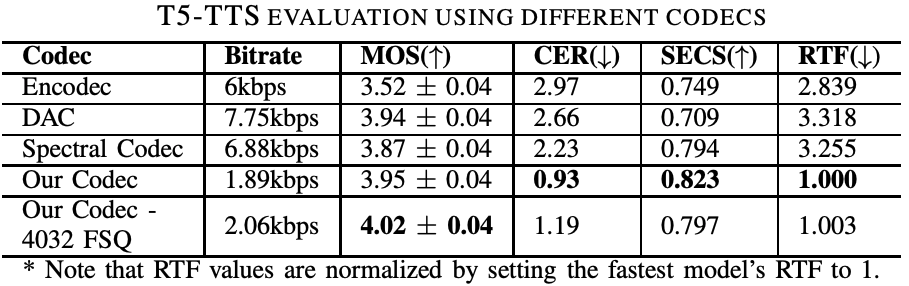{.nostretch fig-align="center" width="70%"}

- Encoder–decoder **T5-TTS** trained on **1.8k hours** of English
- **RVQ** uses a **delay pattern**; the Spectral Codec and LFSC are predicted **in parallel**
- Much better than the baselines, and also beats the **4032**-level FSQ variant

<div class="fragment" style="background: #f0f4f8; border-radius: 12px; padding: 0.8em 1.2em;">

**Reconstruction quality is not fully aligned with TTS quality**

::: {.nonincremental}
- **FSQ 4032** reconstructs well but performs worse downstream
- The strongest **DAC** model (**44.1 kHz**) is only good at reconstruction — it was never optimized for TTS
:::

</div>

# Nano Codec {background-color="#2d4059"}

## Nano Codec — Outline

- Builds upon the **LFSC** with a few modifications
  - **Snake activation** instead of LeakyReLU
  - Different **dilation rates** in the encoder
  - Experiments with **causality** in the encoder and decoder by switching to causal convolutions
  - Replaces the complex **MS-STFT** discriminator with a **multi-band MS-STFT** discriminator
  - Adds a **speaker consistency loss** — maximize the cosine similarity between speaker embeddings of the real and reconstructed audio:

    $$\mathcal{L}_{SC} = -\frac{\alpha}{N} \sum_{n=1}^{N} \cos\left(\phi(x_n),\; \phi(\hat{x}_n)\right) = -\frac{\alpha}{N} \sum_{n=1}^{N} \frac{\phi(x_n) \cdot \phi(\hat{x}_n)}{\lVert \phi(x_n) \rVert_2 \, \lVert \phi(\hat{x}_n) \rVert_2}$$

    where $\phi$ is a pretrained speaker verification encoder and $\hat{x}_n = G(x_n)$

## Nano Codec — Ablations

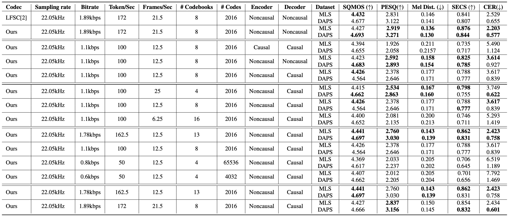{.nostretch fig-align="center" width="65%"}

- The **fully causal** model gives the worst results, the **fully non-causal** one the best
- The **partially causal** model is a good trade-off and better suited to downstream TTS — the only version used from then on
- **6.25 fps** performs poorly; between **12.5** and **25 fps** the authors keep **12.5 fps**, since it is comparable on CER, SECS and SQMOS
- Bitrate reduction (smaller codebooks) is **strongly correlated** with worse CER and SECS
- Finally, **12.5 fps with more FSQ layers** vs **21.5 fps with fewer layers** turn out to be comparable on all metrics

## Nano Codec — Zero-Shot TTS Results

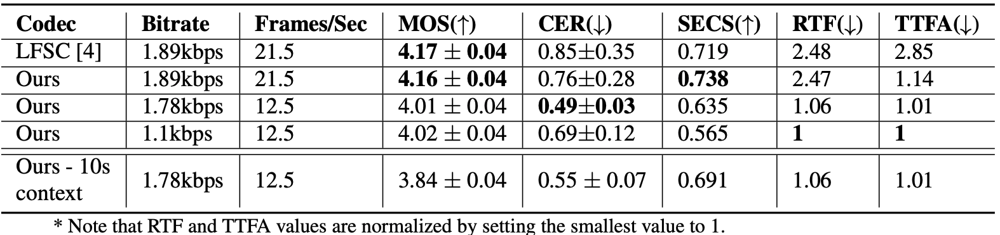{.nostretch fig-align="center" width="80%"}

- **Koel-TTS** — encoder–decoder TTS similar to T5, trained with **CFG** but without **DPO** (RL); a separate model is trained per codec on **18k hours** of English
- Results are **better than or comparable to the LFSC**, with much lower latency (**TTFA**)
- Visible **speaker similarity gap** between **12.5** and **21.5 fps** — interesting observation that at a lower frame rate the prompt is shorter, which itself hurts speaker similarity
